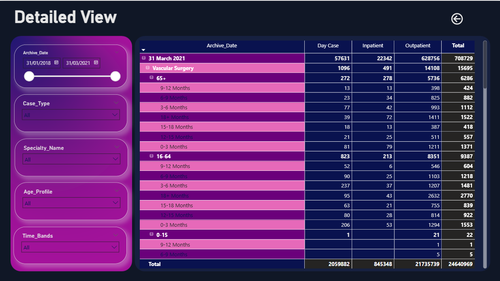

# 🏥 Hospital Analysis Project

## 📚 Project Overview
A Power BI reporting solution designed to give hospital administrators and care teams a clear, interactive view of patient wait-lists over time, broken down by case type, specialty, age group and wait-time bands, to drive operational improvements and resource allocation.

________________________________________
## ❗ Problem Statement
Hospitals face growing elective care backlogs and need to understand:
- How many patients are currently waiting, and how that compares to the prior year
- Which specialties and case‐types have the longest queues
- The distribution of wait times across different age groups
- Month-over-month trends in day-cases, inpatients and outpatients
Without a unified, self-service dashboard, stakeholders lack visibility to prioritize capacity and reduce delays.

________________________________________
## 📊 Key Visuals in the Power BI Dashboard
### 🔎 Summary (High-Level View)
- Total Wait-List Comparison
  - Latest month: `709K`
  - Prior-year same month: `640K`
- Case-Type Split
  - Outpatient `(72%)`, Day Case `(17%)`, Inpatient `(11%)`
  - Overall count: `54K`
- Time-Band vs. Age-Profile
  - Shows average weeks on wait-list by age group `(0–15, 16–64, 65+)` across bands `(0–3 months, 3–6 months… 18 + months)`
- Top 5 Specialties by Wait
  - Paediatric Dermatology `(168 wks)`, Paediatric ENT `(148 wks)`, Paed Orthopaedic `(115 wks)`, Outpatient A&E `(111 wks)`, Paed Cardiology `(102 wks)`
- Monthly Trend Analysis
  - Line charts showing monthly counts of Day Case/Inpatient vs. Outpatient over the multi-year period.

### 📈 Detailed
- Date slider & slicers for Case Type, Specialty, Age Profile, Time Bands
- Table matrix at right:
  - Pivoted by Archive_Date → Specialty → Age_Profile → Time_Band
  - Columns for Day Case, Inpatient, Outpatient, Total
  - Shows exact patient counts and allows expansion/collapse.

________________________________________
## 💡 Key Insights
- Wait-List Growth
  – From January `2018` to March `2021`, total outpatient waits rose from `0.50M` to `0.63M` monthly.
  – Inpatient and day-case lists have remained relatively flat.
- Longest Waits in Paediatrics
  – Paediatric Dermatology and ENT lead with median waits `>140 weeks`.
- Age Profile Trends
  – Patients `65+` have significant long waits `(65+ in Vascular Surgery: 6.3K patients waiting ≥0-3 months, rising to 1.5K in 18+ months band)`.
- Seasonal/Policy Impacts
  – Noticeable dip in early `2020` (COVID impact) followed by backlog rebound through `2021`.

________________________________________
## 🛠️ Tools and Technologies
-	**`Power BI`:** For dashboard creation and data visualization
-	**`DAX`:** For calculated measures and KPIs
-	**`Power Query`:** For data transformation and ETL
-	**`Excel/CSV (implied)`:** As data sources
  
________________________________________
## 🗄️ Database Structure
The dataset includes fields such as:
- `Archive_Date`
- `Case_Type:` Day Case, Inpatient, Outpatient
- `Specialty_HIPE`
- `Specialty_Name`
- `Age_Profile`
- `Time_Bands`
- `Total`

________________________________________
## ⚙️ Key Features
- Dynamic filtering by case type, specialty, age profile, and time bands.
- Interactive breakdowns with drill-down capabilities.
- Comparative monthly trends and year-over-year analysis.
- Visualization of KPIs and patient backlog by specialty.
- Automated total computation across time and demographics.

________________________________________
## 🚀 How to Run the Project
1.	Open HealthCare Project.pbix in Power BI Desktop.
2.	Ensure data sources are connected or load the dataset if prompted.
3.	Use the filters on the left panel to analyze different dimensions.
4.	Navigate between the Summary and Detailed View tabs for insights..
   
________________________________________
## 📄 Access Full Documentation
👉  Dataset [link](./Dataset/financial_loan.csv)

________________________________________
## 🙌 Acknowledgments
Special thanks to:
- Pivotalstats
- Healthcare institutions providing anonymized waitlist data.
- Microsoft Power BI community for visual and technical support.
